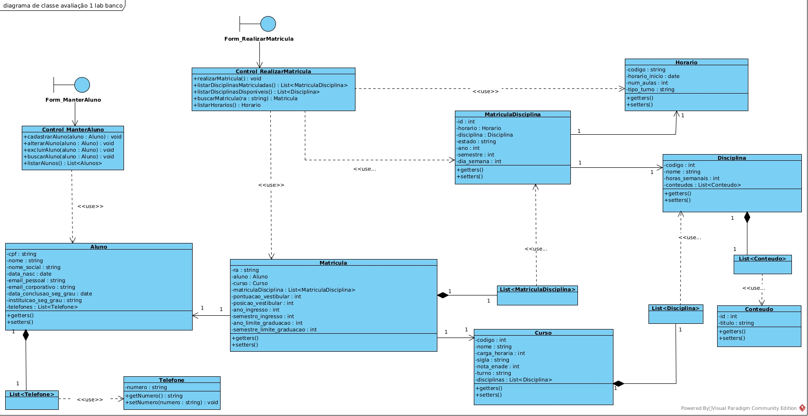

# Atividade 01 Laboratório de Banco de Dados

Trabalho Para Matéria de Laboratório de Banco de Dados

## Integrantes
Débora Cristina; RA 1110482212031
Luan Camilo Nogueira; RA 1110482212016

## Diagramas
 
  
  
